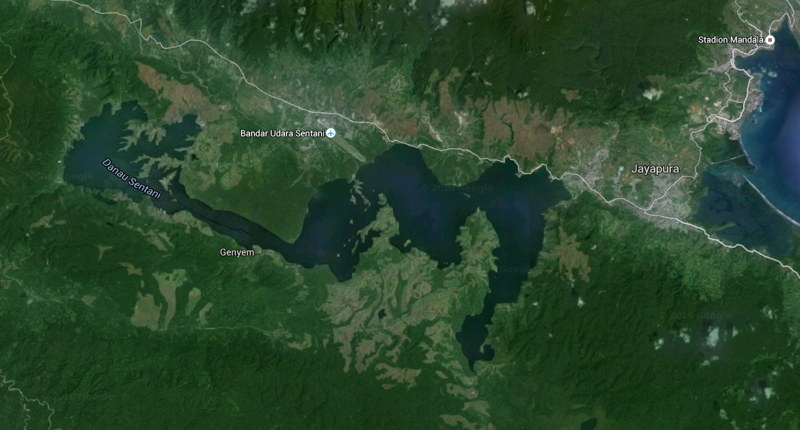

# Abstract

- new generation in under-served areas often too high
- we compare survey estimation to observed electricity use

# Introduction

## Global Topic

- global electricity access is poor
- many areas require private capital to install electricity
- part of problem is upfront investment cost
- due to perceived business risk, upfront capital is costly [@JaramilloReview2015]

## Oversizing

- generation is frequently allocated at levels that are too high
- oversized microgrids based on overestimated demand that cannot meet
    revenue targets contribute to this perception [@USAID2015]
- Schnitzer has shown the consequences of generators with excess
    capacity on microgrid operation [@Schnitzer2014]
- Schnitzer Haiti Thesis data can provide evidence
- quantify the level and frequency of generator mismatch
- to avoid excess capacity, systems must be sized appropriately
- accurate sizing requires accurate demand estimation

## Demand estimation informs sizing

- estimating demand in areas without access is challenging (citation)
- through more accurate appliance estimation, we may achieve more
    accurate energy estimation
- with more accurate energy estimation, a micro-utility can reduce
    the variance in revenue
- reductions in revenue variance should lead to lower-cost capital
    [@JaramilloReview2015]
- we explore methods for bottom up estimation of appliance ownership
    and compare to observed electricity consumption

## Contribution

- more accurate forecasting of appliance purchases, use, and resulting
    electricity demand can improve financial performance by improving
    the procurement of power generation equipment
- we use surveys of rural household appliance ownership and compare to
    observed electricity consumption to verify the accuracy of a
    bottom-up method

## literature review of rural energy forecast theory and results

- Schnitzer Thesis
- Paatero
- ASHRAE Fundamentals Ch. 19
- World Bank WPS4866

# Methods Overview

- We compare observed electricity consumption with a bottom-up
    estimation based on appliance survey data
- Collect survey data on current per household appliance ownership
    including hours of operation
- Extrapolate energy usage based on a estimations of power
- Measure distribution of daily energy for measured villages
- Compare predicted to observed energy usage from metered villages

## Lake Sentani Description

<!-- todo: village sizes -->

- Lake Sentani is an inland lake in Indonesia
- Near the coastal city of Jayapura
- Many island communities
- Area is surrounded by some grid access
- Other areas accessed by community or utility administered microgrids

## Survey Basic Description

- The survey was designed to ask questions relevant to the electricity
    needs of the community
- The survey was designed and administered by Advancing Energy and Cenderwash University
    as part of an electrification effort in the Lake Sentani region
- Survey carried out in Q3 and Q4 of 2014
- The survey used the ODK platform which allows for the electronic
    collection of data from hand-held tablet devices
- The data was stored online using Ona
- The survey collected data on electricity use and assets for 1184
    households in the Lake Sentani region

<!-- survey_counts.ipynb -->

|                     |   total_surveys |   AE_count |   percent_surveyed |   valid_fraction_HH |
|:--------------------|----------------:|-----------:|-------------------:|--------------------:|
| PLN_grid            |             619 |        660 |           0.937879 |            0.631818 |
| PLN_microgrid       |             170 |        170 |           1        |            0.676471 |
| community_microgrid |              54 |         60 |           0.9      |            0.75     |
| no_access           |             341 |        398 |           0.856784 |            0.457286 |

- The survey covered dozens of villages with different levels of electricity access.
- 26 Villages were surveyed
- We define three access types: grid, microgrid, no centralized
- Electricity access among the surveyed households ranged from grid access to village-level access, to only household-level sources of energy
- Range of percentage of households surveyed per village
- Average households surveyed per village
- Percentage of households surveyed per village
- Percentage of households by access type
- Of the total households available in a given village, the percentage surveyed ranged from 45% to 75%

# Bottom Up Electricity Estimation

- We use our survey instrument to estimate the electricity use by villages
- Information on the ownership of appliances and their use are combined with assumptions about the power level of appliances to form an estimate.

## Survey Electricity Use Questions
- The survey collected information on appliance ownership and use
- we observe appliance ownership by household
- We observe the reported percentage of appliance ownership in each access type or village by summing the yes/no response and dividing by the number of respondents
- we also observe hours per day and days per week of use
- We report for lighting, mobile phones, television, radio, refrigerators, fans, and rice cookers
- we estimate the power level of appliances
- multiplying the average power by the hours of use per day gives the energy per day
- By summing over these appliance types, we can estimate the overall electricity use
- we assume the population of non-responses has the same composition as the respondents
- from this, we create an estimate of the energy per day consumed if all appliances working and grid has 100% uptime
- From this method we can estimate the total energy use as well as the contribution of each type of appliance
- We observe two contributions to variation
    - Patterns of appliance ownership
    - Patterns of appliance usage
- If these villages are similar in other respects, we expect the locations with less reliable electricity to change their behavior to be similar to the grid when reliable electricity arrives.
- Latent demand has two factors, appliance purchase and service increase

## Variation in Appliance Ownership Results

- We observe a low variation for TV, lighting, and mobile phone ownership across access types
- These are highly desirable services with modest energy requirements
- We observe higher variation for rice cookers and refrigerators with ownership concentrated in areas with grid connections
- Since these appliances require greater power and energy, we expect grid locations
- We observe variation in radio ownership with concentration of ownership in off-grid and community run microgrid areas
- label: appliance-ownership-by-access-type

## Variation in Hourly Use Results

- Survey responses indicate more appliance use in grid connected areas.
- This reveals a measure of latent demand
- We observe appliance energy variation by access type
- table: hourly results by access-type or comparison village
- Figure: appliance-hours-detail
- 2016-02-22-appliance-hours-detail.ipynb
- figure: appliance-hours-by-access-type

# Electricity Consumption Measurements

- We observe electricity consumption by village
- Electricity consumption varies by connection type
- We observe 85% or greater uptime for grid connected villages
- We observe 15% to 25% uptime for microgrids
- We estimate daily use by only measuring the days with a full day of
    electricity usage
- Table:
- rows: measured villages, access type
- columns: average daily energy, unconstrained daily energy

# Comparison of predicted and observed electricity use

- We focus on the five villages in our survey that also have electricity data
- Table or figure:
- rows: measured villages, access type
- columns: estimated daily energy use, observed average, unconstrained
    daily
- 2016-03-01-electricity-comparisons.ipynb

- the appliance estimations underestimate the energy use observed on
    these grids
    - constraints on electricity availability should lead to overestimation
    - ownership estimation errors
    - number of lighting points isn't observed in survey
    - unobserved or recently acquired appliances
    - variance in power levels

# Discussion and Conclusion

## Latent demand

- Latent demand has multiple sources
- The delivery of reliable electricity will stimulate appliance purchase
- The delivery of reliable electricity will increase use in some
    appliances
- this forecasting comparison is valuable to practitioners
- refining estimates will improve revenue and cost of capital long term

## Future work

- longitudinal observations will allow us to observe the growth of
    appliance ownership through acquisition and the accompanying growth
    in electricity use
- estimates of electricity increase from latent demand
- signals in electricity use that signal latent demand increases
